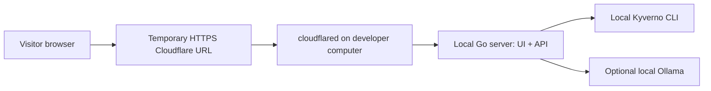

# Free Cloudflare hosting plan

Checked against official Cloudflare documentation on 9 October 2026. This is a deployment plan, not a claim that the application is published.

## Decision

Keep the Go API and real Kyverno engine. Use **Cloudflare Tunnel for the first fully functional shareable demo**. Plan **Cloudflare Pages for the stable frontend**, with the backend reached through a same-origin proxy to a running origin.

The complete native Go/Kyverno backend needs a host with process execution. Cloudflare's free Workers runtime cannot run our existing server and spawn the Kyverno CLI. Cloudflare Containers supports native runtimes but is available on the Workers Paid plan, currently starting at USD 5/month with additional usage pricing. Do not describe this option as free.

Sources:
- Containers availability: https://developers.cloudflare.com/containers/
- Containers pricing: https://developers.cloudflare.com/containers/platform/pricing/
- Workers limits: https://developers.cloudflare.com/workers/platform/limits/

## Stage 1 — Free live demonstration through Tunnel



Run PolicyLens, then run `cloudflared` separately:

```sh
make run
# In another terminal, after installing cloudflared:
cloudflared tunnel --url http://127.0.0.1:8080
```

This produces a temporary `trycloudflare.com` URL. The local computer, API and tunnel must remain running and online. Stopping the tunnel removes access. Quick Tunnels are for development/testing, have a concurrent-request limit and no uptime SLA; they are not durable application hosting. No domain purchase is needed for the temporary URL.

This stage exposes the same frontend and backend on one origin. Verify Origin/Host forwarding and all API paths before sharing; the application rejects mismatched browser origins. Keep the server bound to localhost, expose only the application port, use the fixed sample policy pack, and avoid entering confidential configurations.

Sources:
- Quick Tunnels: https://developers.cloudflare.com/cloudflare-one/networks/connectors/cloudflare-tunnel/do-more-with-tunnels/trycloudflare/
- Tunnel overview/setup: https://developers.cloudflare.com/tunnel/get-started/

## Stage 2 — Permanent free frontend on Pages

React/TypeScript assets can run on Cloudflare Pages Free. Current documented limits include 500 builds/month, 20,000 files/site and 25 MiB per asset; this project is comfortably below the asset limits. Pages Functions use the Workers quota. The current Workers Free quota includes 100,000 requests/day and 10 ms CPU time/request.

Sources:
- Pages limits: https://developers.cloudflare.com/pages/platform/limits/
- Workers limits: https://developers.cloudflare.com/workers/platform/limits/

Planned deployment configuration:

| Setting | Value |
|---|---|
| Repository | `RenuBhati/policylens` |
| Production branch | `main` |
| Build command | `cd frontend && npm ci && npm run build` |
| Build output | `internal/server/web/dist` |
| Node.js | 22 |
| Address | A free generated `pages.dev` subdomain |

Pages alone serves static assets. The current React application calls `/api/*`; publishing the assets without an API will not create a functioning full demo. A Pages Function or Worker proxy must forward only those API paths to a configured backend. The native policy evaluation happens at that origin, not in the Worker.

Before this stage:

1. Add and test the same-origin proxy, including an allowlisted backend origin, bounded timeouts, request IDs and explicit offline errors.
2. Configure a persistent origin, or document that a developer-hosted backend is only available during demonstration hours. A named Tunnel alone does not supply compute.
3. Decide whether an existing domain is available for a named Tunnel; a new domain has a separate cost.
4. Add correct Origin handling for the known Pages hostname. Do not broadly disable cross-origin checks.
5. Apply edge request limits and a model budget. The current socket-IP limiter sees a tunnel/proxy peer and cannot independently identify every remote visitor.
6. Keep backend credentials and any proxy secrets in server-side environment bindings, never Vite variables or Git.
7. Publish after a complete check of the live paths: sources, examples, failing/corrected checks, questions and backend-unavailable behavior.

## Optional always-available read-only demo

A static Pages edition could bundle the six policy explanations and source links for always-available exploration. Recorded Kyverno results must be clearly labelled as recorded examples; arbitrary edited configurations must never receive a fabricated live validation result. This edition would not need a backend for browsing, but is separate future work, not the current application behavior.

## Costs and constraints

| Option | Cloudflare spend | Backend availability |
|---|---|---|
| Quick Tunnel of complete local application | No Cloudflare hosting charge | While local computer/processes are running; temporary URL |
| Pages frontend + developer-hosted backend through Tunnel | Free within quotas | Frontend stable; live checks depend on backend uptime |
| Pages frontend + a separate free backend provider | Free if both services remain within their terms | Depends on provider quotas, sleep and retention rules; evaluate separately |
| Cloudflare Containers for the native backend | Paid Workers plan plus applicable usage | Managed compute; outside the zero-cost requirement |

Local electricity/internet and any model/API usage are separate from Cloudflare charges. For the first interview demo, use source-excerpt mode or a local model to avoid a paid model API.

## Acceptance criteria for publication

- Public source links identify the pinned revision.
- No login is required to try the supplied sample workspace.
- The failing sample fails six rules, corrected sample passes six, and a removed label produces one failure.
- Unavailable origin/engine/model states are explicit and never presented as passing checks.
- Only the application is exposed; policy execution is fixed, bounded and independent of model output.
- Public URL, backend availability expectations and deployment instructions are recorded in README.
- The site and backend receive a final verification after deployment.
