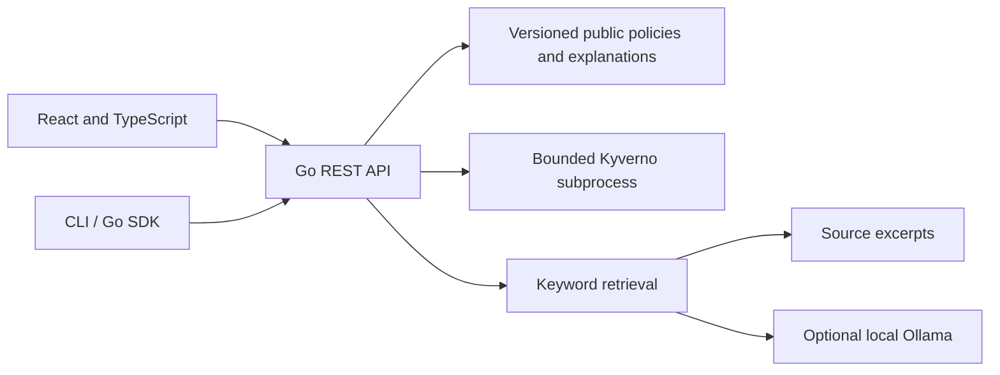

# PolicyLens — Product Requirements Document

Status: approved direction; MVP implementation in progress  
Date: 9 October 2026  
Audience: early-career developers, platform engineers, security reviewers

## 1. Product goal

Help a developer understand a public Kubernetes security policy, inspect a concrete example, and evaluate a Pod configuration against a named, versioned set of policies. Provide a useful public demonstration of Go backend engineering and grounded GenAI capabilities for the Citi early-career engineering role.

Product promise: **Understand a rule. Check an example. Explain the result with sources.**

## 2. Problem

Policy documentation, executable definitions and example resources are often separated. Beginners may understand a validation error without understanding the affected field, rationale or required change. General-purpose chat answers can invent rules, confuse configurable organisational rules with Kubernetes standards, or imply that a passing sample proves a complete security review.

PolicyLens connects the original definition, a beginner explanation, grounded question answering and an actual engine result in one small application.

## 3. Users and jobs

| User | Job to be done | Success |
|---|---|---|
| Developer learning Kubernetes | Understand a rule without reading every engine expression | Can identify the relevant field and explain its purpose |
| Platform engineer | Reproduce a policy violation on a sample Pod | Sees engine result, policy identity and concrete evidence |
| Interview reviewer | Assess implementation and engineering judgment | Can run the project, inspect tests and reproduce the demonstration |

## 4. MVP scope

### Policy collection

Bundle six unmodified public Kyverno policy definitions: disallow privileged containers, require non-root execution, disallow privilege escalation, disallow latest image tags, restrict image registries, and require application labels. Pin the upstream Git revision and compatible Kyverno CLI version. Keep original license and per-file SHA-256 digests. Author clearly identified explanatory summaries separately.

Pod-security-derived controls and configurable best-practice controls must have separate category labels. The bundled registry list is an upstream example configuration, not a universal Kubernetes rule or a Citi policy.

### Policy exploration

- Policy cards with title, category, short explanation and affected field.
- Selected policy detail containing rationale, authored explanation and original YAML.
- Immutable source link, engine version and source revision.
- Suggested beginner questions and a searchable policy list.

### Configuration checking

- Accept one Kubernetes `v1` Pod as YAML or JSON, with a maximum size of 64 KiB.
- Evaluate against the fixed pack using the pinned Kyverno CLI.
- Return a per-policy result: pass, fail, skipped or error, with engine messages.
- Provide an insecure example and a corrected example that demonstrably pass/fail the pack.
- Distinguish validation failures from parser, engine and timeout errors.
- Label the check as limited to the selected pack and supported resource type.
- Do not connect to a cluster, run deployment commands, pull images or accept user-defined policy code.

### Grounded question answering

- Retrieve authored policy explanations by keyword ranking; show evidence and source references.
- Default key-free mode quotes retrieved policy passages and is labelled `Source excerpts`.
- Optional Ollama mode generates a structured answer from the retrieved evidence.
- Validate generated citation identifiers against retrieved passage identifiers.
- For empty retrieval, respond that there is no supporting source in this collection.
- For provider failure or invalid generated references, return an explicit model error; do not disguise source excerpts as generated answers.
- Treat retrieved text as untrusted data. Document that citation existence does not prove semantic faithfulness and that prompt instructions do not guarantee resistance to injection.

### Accessibility and public demonstration

- The sample experience requires no login, credentials or cluster.
- Keyboard-operable controls, labelled form inputs, visible focus indicators, sufficient contrast and announced loading/error states.
- Responsive layout with readable policy text and scrollable code examples.
- A local web interface and reproducible container setup. Public hosting is a subsequent milestone, with rate limits, model budget and operational review.

### Developer experience

- Go HTTP SDK and CLI commands for policy listing, question answering and checks.
- REST contract, README, demo script and architecture notes.
- Automated Go tests and frontend type/build checks in CI.
- Integration checks invoke the real pinned engine; they are not replaced by model output or mirrored custom rule evaluation.

## 5. User journeys

1. Open PolicyLens and browse six public rules.
2. Select a rule, read its explanation and inspect the original source.
3. Load the insecure example and run a check.
4. Inspect failed rules and the affected configuration fields.
5. Load the corrected example and repeat; verify passing engine results.
6. Ask a related question; inspect evidence and the explicitly labelled answer mode.
7. Open a linked source or repeat the check through the CLI.

## 6. Functional API

| Endpoint | Input | Output |
|---|---|---|
| `GET /healthz` | None | Process health |
| `GET /readyz` | None | Engine readiness; unavailable is HTTP 503 |
| `GET /api/status` | None | Engine availability/version, answer mode and pack provenance |
| `GET /api/policies` | None | Curated policy metadata and source definitions |
| `GET /api/examples` | None | Failing and corrected Pod manifests |
| `POST /api/check` | `{ "manifest": "..." }` | Engine results, count summary and duration |
| `POST /api/ask` | `{ "question": "...", "policy_id": "optional" }` | Answer, citations, evidence, mode and duration |

Errors use `{ "error": "message", "request_id": "..." }`. Request IDs are returned as headers. Unsupported methods and paths must not render the web app as a successful API response.

## 7. Non-functional requirements

- Go service uses explicit HTTP timeouts, bounded request bodies and subprocess concurrency limits.
- Fixed validated engine executable; argument arrays and temporary files, never shell interpolation of user data.
- Engine subprocess has a deadline; temporary manifests and policy files are removed after use.
- Default server binds to localhost. Container deployment explicitly binds to all interfaces.
- Routine logs contain request IDs, method, path, status and duration, excluding submitted manifests, prompts, tokens and generated answers.
- Public API has an in-process per-IP request limit; document single-instance scope and proxy limitations.
- Engine errors fail visibly. An unavailable engine cannot produce a passing result.
- Local static assets are served by the Go service; development uses a frontend proxy.
- Immutable policy files are embedded in the binary. This MVP needs no database.

## 8. Architecture

Validation and answer generation are separate operations. Kyverno establishes pack compliance; model text provides an explanation. Neither a model answer nor a six-rule pass establishes complete cluster security or actual admission behavior.

## 9. Acceptance criteria

- A fresh developer can follow documented commands to build the UI, install the pinned engine, test and start the service.
- The bad example produces known policy failures; the good example passes all six rules.
- Missing/malformed YAML, multiple resources, unsupported kinds and oversized payloads are rejected.
- Missing or incompatible Kyverno produces an explicit unavailable status/error.
- Question responses include evidence; off-topic questions with no matching source abstain.
- Generated responses with unknown/no required citations are rejected in provider tests.
- Concurrent engine checks are bounded and request cancellation propagates to the process.
- UI supports keyboard navigation and clearly distinguishes source excerpts from LLM generation.
- CLI invokes the same backend contract as the UI.
- Policy source digests are verified and licenses preserved.

## 10. Evaluation and success metrics

Create a labelled question set covering each rule, queries outside this collection and paraphrases. Measure retrieval top-three hit rate against expected policy IDs. Record actual results, denominator and limitations; never label retrieval scores as confidence percentages.

Use engine fixtures for passing, failing and mixed inputs. Measure local check duration and provider duration separately. Review generated answers manually for source support and appropriate abstention. Deterministic provider test doubles validate integration contracts, not real model quality.

## 11. Explicit exclusions

Live cluster enforcement; universal security certification; full Pod Security Standards coverage; RBAC or NetworkPolicy evaluation; arbitrary policy execution; multiple document uploads; image vulnerability scanning; automatic deployment; multi-tenant authentication; production SSO; database persistence; Redis caching; automatic upstream updates; fine-tuning.

## 12. Milestones

1. **Foundation:** PRD, six verified sources, Go API and real-engine wrapper.
2. **Usable demo:** policy explorer, editor, examples, results, source-backed questions.
3. **Engineering evidence:** CLI/SDK, tests, evaluation, CI, Docker and demo guide.
4. **Later:** semantic retrieval, persisted custom collections, OAuth/OIDC, Kubernetes deployment validation, public deployment and VPN/Tailscale collection.

## 13. Risks and decisions

| Risk | Decision |
|---|---|
| Upstream syntax changes | Pin a Git revision and CLI release; upgrade deliberately with engine tests |
| Model invents a rule | Retrieve evidence, validate references, label generated output, evaluate faithfulness |
| Check implies production admission | State selected pack and offline-check scope; show audit versus enforcement context |
| Submitted resources contain confidential data | Use samples by default; no routine content logging or persistence |
| Optional model is unavailable or slow | Key-free source-excerpt mode remains independently usable |
| Initial scope overwhelms a learner | Ship one curated collection and one supported resource type |

## 14. Public references

- Kyverno policies: https://github.com/kyverno/policies
- Kyverno CLI: https://kyverno.io/docs/kyverno-cli/reference/kyverno_apply/
- Kubernetes Pod Security Standards: https://kubernetes.io/docs/concepts/security/pod-security-standards/
- Ollama chat API: https://docs.ollama.com/api/chat
- Future VPN collection: https://tailscale.com/docs/reference/examples/grants
